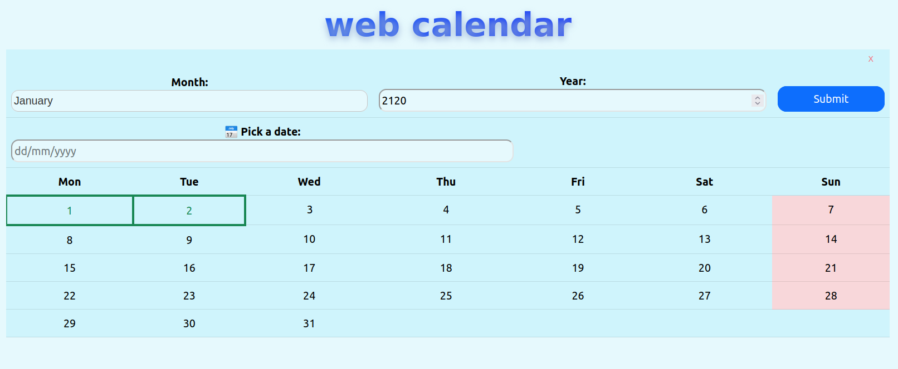

# web-calendar
implementation of a simple graphic calendar

## Functionality

The calendar provides the following functionality:

- Display of the selected month and year
- Display of holidays and special events
- Selection of a specific date
- Display of the selected date and any associated events
- Minimise or expand the calendar

## Project structure

- calendar.html: main HTML for calendar interface
- /styles/style.css: styles for the calendar interface
- /src/script.ts: typescript for calendar logic and DOM manipulation
- /server/server.ts: 
- run.sh: bash script with simple commands to run/compile program

## Run program

Site is deployed and available with github-pages at: https://spin311.github.io/web-calendar/

You can fork repository and run it localy using command `npm start`

OR

run script `./run.sh` and type appropriate command to run/compile locally (r or b)
